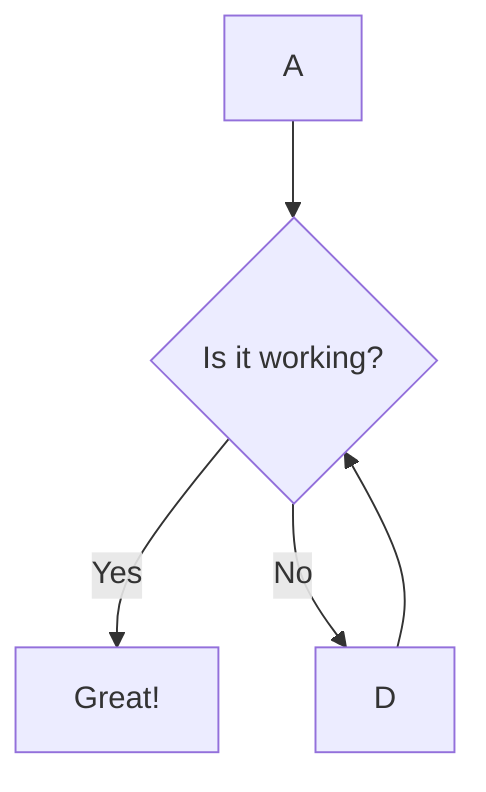

# Astro 25H1 핵심 변경사항

## 요약

2025년 상반기(1월~6월) 동안 Astro 프레임워크는 5.2부터 5.10까지 총 9개의 마이너
릴리스를 통해 상당한 발전을 이루었습니다. 이 기간 동안 Astro는 핵심 기능의 안정화,
개발자 경험 개선, 그리고 동적 콘텐츠 처리 역량 확장에 중점을 두었습니다.
프레임워크는 정적 사이트 생성(SSG)의 강점을 유지하면서도, 실시간 데이터 통합 및
서버 사이드 렌더링(SSR) 시나리오를 위한 새로운 도구를 제공하며 하이브리드 웹 개발
분야에서의 선도적 위치를 강화했습니다.

주요 변경사항으로는 반응형 이미지, 세션 API, SVG 컴포넌트 등 기존 실험적 기능들의
안정화가 두드러지며, 이는 개발자들이 이러한 기능들을 프로덕션 환경에 보다 안심하고
도입할 수 있게 합니다. 또한, 실험적 라이브 콘텐츠 컬렉션, 폰트 API, astro:env,
astro:config와 같은 새로운 기능들은 개발 워크플로우를 간소화하고 타입 안정성을
강화하여 생산성을 크게 향상시킬 것으로 기대됩니다. Node.js 및 TypeScript 버전
요구사항 상향, `@astrojs/image` 및 `<Markdown />` 컴포넌트 제거와 같은 주요 변경사항들은
업그레이드 시 코드 마이그레이션을 필요로 하지만, 이는 프레임워크의 현대성과 성능
유지를 위한 필수적인 조치로 평가됩니다.

Astro 5.0 에서 도입된 Content Layer, Server Islands, 그리고 다양한 실험적 기능들이
2025년 상반기 동안 5.7 및 5.10 릴리스에서 안정화되고, 동시에 5.10에서 Live
Content Collections 와 같은 새로운 실험적 기능들이 지속적으로 추가되는 패턴을
관찰할 수 있습니다. 이러한 발전 경로는 Astro가 단순히 새로운 기능을 빠르게 추가하는
것을 넘어, 기존 핵심 기능들을 견고하게 다지면서도 미래 지향적인 동적 웹 개발
요구사항에 발맞춰 프레임워크의 범위를 전략적으로 확장하고 있음을 보여줍니다. 이러한
접근 방식은 개발자들에게 안정적인 기반 위에서 혁신적인 기능을 탐색할 기회를
동시에 제공합니다.

## 1. 서론

### 프레임워크 'Astro' 개요

Astro는 현대적인 웹 애플리케이션 구축을 위한 다목적 웹 프레임워크로, 특히 콘텐츠
중심 웹사이트(블로그, 마케팅 사이트, 전자상거래 등)에 최적화되어 있습니다. 이
프레임워크는 "Zero JavaScript by Default"(기본적으로 JavaScript 제로) 원칙을 통해
초기 로드 시간을 극대화하며, 혁신적인 아일랜드 아키텍처(Islands Architecture)를
통해 필요한 부분에만 JavaScript를 선택적으로 적용하여 최적의 성능을 제공합니다.

Astro는 프레임워크에 구애받지 않는(Framework Agnostic) 특성을 지녀 React, Vue,
Svelte 등 개발자가 선호하는 UI 프레임워크를 자유롭게 통합할 수 있습니다. 또한,
모듈형 컴포넌트 설계, 빠른 성능, 간소화된 데이터 관리, 하이브리드 렌더링 기능,
SEO 최적화, 접근성 도구 등을 주요 특징으로 합니다. 이러한 독특한 기능들은 Astro를
현대 웹 개발에서 성능, 사용자 경험, 콘텐츠 전달을 우선시하는 강력하고 유연한
선택지로 자리매김하게 합니다.

### 2025년 상반기 변경사항의 중요성 및 보고서 목적

2025년 상반기는 Astro 프레임워크가 5.x 버전대에서 빠르게 발전하며 여러 중요한
기능들을 안정화하고 새로운 실험적 개념을 도입한 시기입니다. 이 기간 동안의 변화는
Astro 생태계의 활발한 발전과 시장 변화에 대한 민첩한 대응을 명확하게 보여줍니다.
이 보고서는 2025년 1월 1일부터 6월 30일까지의 Astro 프레임워크 변경사항을
종합적으로 조사하고, 특히 코딩 구현에 직접적인 영향을 미치는 핵심 변경사항들을
상세히 정리하여 개발자들이 효과적으로 업그레이드를 계획하고 새로운 기능을 활용할 수
있도록 실질적인 정보를 제공하는 것을 목적으로 합니다.

Astro는 2024년 12월 3일에 5.0 버전을 출시한 이후 , 2025년 상반기에만 5.2부터
5.10까지 총 9개의 마이너 버전을 출시하였습니다. 이러한 빠른 릴리스 주기는 Astro
팀의 활발한 개발 노력과 시장 변화에 대한 민첩한 대응을 보여줍니다. 그러나 동시에
개발자들에게는 최신 기능을 도입하고 최적의 성능을 유지하기 위해 지속적으로
프레임워크 변경사항을 추적하고 코드베이스를 업데이트해야 하는 과제를 부여합니다.
이는 Astro 생태계의 활력을 증명하는 동시에, 개발팀의 꾸준한 학습과 적응을
요구하는 양면성을 지닙니다.

## 2. 2025년 상반기 Astro 주요 릴리스 개요

2025년 상반기 동안 Astro는 5.2부터 5.10까지의 다양한 마이너 업데이트를 통해
프레임워크의 기능성과 안정성을 지속적으로 향상시켰습니다. 각 릴리스는 특정 영역에
초점을 맞춰 새로운 기능을 도입하거나 기존 기능을 개선하였습니다.

| 버전 (Version) | 릴리스 날짜 (Release Date) | 주요 특징 (Key Highlights) |
| :--- | :--- | :--- |
| Astro 5.2 | 2025년 1월 30일 | Tailwind 4 지원, 트레일링 슬래시/외부 리다이렉트, Markdown 내 TOML 프론트매터, 실험적 astro:config, React 스트리밍 비활성화 |
| Astro 5.3 | 2025년 2월 13일 | 더 빠른 페이지 렌더링 성능 개선, 실험적 세션 설정 간소화 |
| Astro 5.4 | 2025년 2월 25일 | Markdown 내 원격 이미지 최적화, 실험적 반응형 이미지 개선, 개발/미리보기 서버 허용 목록, Vercel ISR RegExp 지원, 새로운 설정 헬퍼/빌드 옵션 |
| Astro 5.5 | 2025년 3월 13일 | Mermaid/D2 다이어그램 도구 지원 강화, 실험적 세션 타입 안정성, Markdown 호환성 개선 |
| Astro 5.6 | 2025년 4월 3일 | Cloudflare 환경 astro:env 전역 지원, 프리페칭 제어 기능 제공 |
| Astro 5.7 | 2025년 4월 15일 | 세션 API 및 SVG 컴포넌트 안정화, 새로운 실험적 폰트 API, 설정 임포트 기능 추가 |
| Astro 5.8 | 2025년 5월 19일 | Node.js 최소 요구 버전 상향 (v20.3.0, v22.0.0 이상) |
| Astro 5.9 | 2025년 6월 5일 | 실험적 콘텐츠 보안 정책(CSP) 지원, 콘텐츠 로더에서 Markdown 렌더링 기능 추가 |
| Astro 5.10 | 2025년 6월 19일 | 반응형 이미지 안정화, 실험적 라이브 콘텐츠 컬렉션, CSP 개선, Cloudflare Workers 진입점 사용자 정의 |

Astro 5.0에서 도입된 주요 기능들(예: 이미지 최적화, View Transitions, Sessions)이
2025년 상반기 동안 5.7 , 5.10 릴리스를 거치며 "실험적" 딱지를 떼고 "안정화"
단계로 진입하는 패턴은 Astro 팀이 단순히 기능을 추가하는 것을 넘어, 프로덕션
환경에서의 안정성과 신뢰성을 중요하게 생각하고 있음을 보여줍니다. 동시에 5.9의
실험적 CSP 및 5.10의 실험적 Live Content Collections 와 같은 새로운 "실험적"
기능의 지속적인 도입은 Astro가 혁신을 멈추지 않고 미래 웹 개발 트렌드에 선제적으로
대응하려는 의지를 나타냅니다. 이러한 이중 전략은 Astro가 개발자들에게 최신 기술을
빠르게 제공하면서도, 핵심 프레임워크의 견고함을 유지하려는 균형 잡힌 접근 방식을
취하고 있음을 시사합니다.

## 3. 코딩 구현 관련 핵심 변경사항 상세

2025년 상반기 Astro 프레임워크의 변경사항은 개발자가 코드를 작성하고 관리하는
방식에 직접적인 영향을 미칩니다. 다음 표는 주요 변경사항을 유형별로 분류하고, 각
변경이 개발에 미치는 영향과 권장되는 조치를 요약하여 제시합니다.

| 변경사항 (Change) | 유형 (Type) | 영향 (Impact) | 권고사항 (Recommendation/Action Required) |
| :--- | :--- | :--- | :--- |
| 반응형 이미지 및 이미지 최적화 | 새로운 기능 및 개선 | 이미지 로딩 성능 및 사용자 경험 향상, SEO 개선. | astro.config.mjs에서 image.responsiveStyles 활성화, `<Image />` 컴포넌트 layout, priority, fit, position 속성 활용. |
| 실험적 라이브 콘텐츠 컬렉션 | 새로운 기능 및 개선 (실험적) | 런타임 데이터 페칭 가능, 동적/실시간 콘텐츠 구현 용이, 재빌드 필요성 감소. | astro.config.mjs에 experimental.liveContentCollections: true 설정, src/live.config.ts에 라이브 컬렉션 정의, getLiveCollection()/getLiveEntry() 사용. |
| 세션 API 안정화 | 새로운 기능 및 개선 | 사용자별 데이터 서버 저장 가능, 쇼핑 카트/로그인 상태 관리 용이, 클라이언트 JS 불필요. | Astro.session을 통해 세션 접근, src/env.d.ts에 App.SessionData 인터페이스 정의, 필요시 session.load() 사용. |
| SVG 컴포넌트 지원 | 새로운 기능 및 개선 | SVG 파일 직접 컴포넌트화, 수동 변환 불필요, 개발 편의성 증대. | .svg 파일을 직접 임포트하여 Astro 컴포넌트처럼 사용, width, height, fill 등 속성 전달. |
| 실험적 폰트 API | 새로운 기능 및 개선 (실험적) | 폰트 로딩 최적화 자동화, 성능 개선, 통합된 폰트 관리. | astro.config.mjs에 experimental.fonts 설정, `<Font />` 컴포넌트 사용, preload prop 활용. |
| astro:env 전역 지원 | 새로운 기능 및 개선 | 환경 변수 접근 일관성 확보 (Cloudflare 포함), 개발 복잡성 감소. | 미들웨어 등 서버 코드에서 astro:env/server를 통해 환경 변수 임포트 및 사용. |
| Markdown 내 TOML 프론트매터 및 렌더링 개선 | 새로운 기능 및 개선 | Markdown 메타데이터 관리 유연성, 기술 문서 시각화 개선, 외부 Markdown 렌더링 통합. | TOML 프론트매터 +++ 사용, rehype-mermaid 등 플러그인 설치, astro.config.mjs 설정, 콘텐츠 로더에서 renderMarkdown 활용. |
| astro:config 및 빌드 옵션 헬퍼 | 새로운 기능 및 개선 | 설정 값 타입 안정성 확보, 프로그래밍 방식 빌드 제어, 프레임워크 확장성 증대. | astro.config.mjs에 experimental.serializeConfig: true 설정, astro:config/client 또는 /server 임포트, mergeConfig/validateConfig 활용. |
| 다이어그램 도구 지원 | 새로운 기능 및 개선 | Markdown 내 다이어그램 직접 생성 및 렌더링, 기술 문서의 표현력 향상. | rehype-mermaid 등 플러그인 설치, astro.config.mjs에서 markdown.syntaxHighlight.excludeLangs 및 rehypePlugins 설정. |
| 프리페치 제어 | 새로운 기능 및 개선 | 프리페칭 전략 세밀 제어, 리소스 낭비 최소화, 성능 최적화. | astro:prefetch의 prefetch() 함수에 eagerness 옵션 (immediate, eager, moderate, conservative) 지정. |
| Cloudflare Workers 진입점 사용자 정의 | 새로운 기능 및 개선 | Cloudflare Workers 기능 (Durable Object, Queue) 통합 심화, 엣지 컴퓨팅 활용 증대. | astro.config.mjs의 @astrojs/cloudflare 어댑터에 workerEntryPoint 옵션 추가, 사용자 정의 진입점 파일 생성. |
| Node.js 및 TypeScript 버전 요구사항 업데이트 | 주요 변경사항 | 이전 Node.js/TypeScript 버전에서 실행 불가, 빌드/배포 환경 업데이트 필요. | Node.js를 v20.3.0 이상으로, TypeScript를 v5.0 이상으로 업데이트. import type 구문 사용 권장. |
| `@astrojs/image` 및 `<Markdown />` 컴포넌트 제거 | 주요 변경사항 | 기존 이미지/Markdown 처리 코드 작동 중단, 마이그레이션 필요. | `@astrojs/image` 제거 후 astro:assets 내장 `<Image />` 및 getImage()로 전환. `<Markdown />` 컴포넌트 제거 또는 대안 사용. |
| class:list 동작 변경 | 주요 변경사항 | Set 값 및 class:list prop 직접 사용 불가. | Set 대신 Array 사용, Astro.props['class:list'] 대신 Astro.props['class'] 사용. |
| getStaticPaths() 반환 값 자동 평탄화 제거 | 주요 변경사항 | 중첩 배열 반환 시 빌드 오류 발생 가능. | .flatMap 또는 .flat을 명시적으로 사용하여 평탄한 배열 반환. |
| astro check 외부 패키지화 | 주요 변경사항 | astro check 명령 사용을 위한 추가 패키지 설치 필요. | @astrojs/check 및 typescript 패키지 설치. |
| build.excludeMiddleware, build.split, markdown.drafts Deprecated | 향후 제거 예정 기능 | 이전 설정 옵션 사용 시 경고 발생, 향후 지원 중단. | SSR 어댑터 구성 내 새 옵션(edgeMiddleware, functionPerRoute)으로 업데이트, 콘텐츠 컬렉션 필터링으로 markdown.drafts 대체. |
| 엔드포인트에서 단순 객체 반환 Deprecated | 향후 제거 예정 기능 | 이전 엔드포인트 응답 방식 사용 시 경고 발생, 향후 지원 중단. | Response 객체를 직접 반환하도록 엔드포인트 수정. |

### 3.1. 새로운 기능 및 개선사항

#### 반응형 이미지 및 이미지 최적화

Astro 5.4에서는 Markdown 및 MDX 파일 내 원격 이미지에 대한 자동 최적화 기능이
도입되었습니다. 이 기능은 개발자가 수동으로 이미지를 최적화할 필요 없이, Astro가
원격 이미지를 자동으로 처리하고 최적화하여 성능을 향상시킵니다. Astro 5.10에서는
반응형 이미지 기능이 안정화되어 프로덕션 환경에서 사용 가능해졌습니다. 이는
`srcset` 및 `sizes` 속성을 자동으로 생성하고, 모든 화면 크기에서 이미지가 빠르게
로드되고 잘 표시되도록 필요한 스타일을 생성합니다.

코딩 구현 측면에서, 개발자는 `astro.config.mjs`에서
`image.responsiveStyles: true` 및 `image.layout` (constrained, fixed,
full-width 중 선택)를 설정하여 전역적으로 반응형 스타일을 활성화할 수 있습니다.

`<Image />` 또는 `<Picture />` 컴포넌트에서 `layout` 속성을 개별적으로 설정하여
전역 설정을 재정의할 수 있습니다. 또한, 새로운 `priority` prop을 사용하여 "above
the fold"에 나타나는 중요한 이미지의 로딩을 최적화할 수 있습니다. `priority`를
추가하면 `loading="eager"`, `decoding="sync"`, `fetchpriority="high"`가 자동으로
설정되어 이미지가 즉시 로드되도록 보장합니다. 이 속성은 페이지당 하나의 주요
이미지에만 사용하는 것이 권장됩니다. `fit` 및 `position` 속성을 통해 이미지의 크롭
및 위치를 정밀하게 제어할 수 있는 기능도 추가되었습니다.

```javascript
// astro.config.mjs
export default defineConfig({
  image: {
    responsiveStyles: true,
    layout: 'constrained',
  },
});
```

```astro
<Image src="/hero.jpg" alt="A panoramic view of the mountains" layout="full-width" priority />

<Image src="/profile.jpg" alt="Profile photo" fit="cover" position="center top" width={300} height={300} />
```

Astro는 전통적으로 빠른 성능을 강조해왔으며 , Astro 5.4에서 원격 이미지 최적화를
도입하고 , 5.10에서 반응형 이미지 기능을 안정화한 것은 웹 성능의 핵심 요소인 이미지
처리를 프레임워크 자체에 깊이 내재화하려는 전략을 보여줍니다. 이는 개발자가 별도의
이미지 최적화 도구나 복잡한 설정 없이도 고성능 웹사이트를 구축할 수 있게 하여,
"Blazing Fast Performance"라는 Astro의 핵심 가치 를 더욱 강화합니다. 결과적으로,
개발자는 사용자 경험과 검색 엔진 최적화(SEO) 에 긍정적인 영향을 미치는 이미지
최적화에 더 적은 노력을 기울일 수 있게 됩니다.

#### 실험적 라이브 콘텐츠 컬렉션

Astro 5.10에서 도입된 실험적 라이브 콘텐츠 컬렉션은 빌드 타임이 아닌 런타임에
콘텐츠를 가져올 수 있게 하여 동적이고 실시간 콘텐츠를 가능하게 합니다. 이 기능은
CMS, API, 데이터베이스 등 다양한 소스의 데이터를 통합된 API로 접근할 수 있게 하며,
데이터 변경 시 사이트를 재빌드할 필요가 없어 개발 워크플로우를 크게 간소화합니다.

코딩 구현을 위해서는 `astro.config.mjs`에
`experimental: { liveContentCollections: true }`를 설정하여 기능을 활성화해야
합니다. 라이브 컬렉션은 `src/live.config.ts` 파일에 `defineLiveCollection`을
사용하여 정의되며, 런타임에 데이터를 가져오는 `loader`를 지정합니다. 개발자는
`getLiveCollection()` 및 `getLiveEntry()` 함수를 사용하여 컴포넌트 내에서 라이브
데이터를 가져올 수 있으며, 이 기능은 필터링 로직을 API 레벨로 푸시할 수 있도록
지원합니다. 라이브 로더는 `rendered` 속성을 통해 콘텐츠 렌더링을 지원하며,
`render` 함수와 `<Content />` 컴포넌트를 사용하여 동적 데이터를 표시할 수 있습니다.
또한, 이 API는 완전한 타입 안정성을 제공하며, Zod 스키마를 사용하여 데이터 유효성
검사 및 변환이 가능합니다.

```javascript
// astro.config.mjs
export default defineConfig({
  experimental: {
    liveContentCollections: true,
  },
});
```

```typescript
// src/live.config.ts
import { defineLiveCollection } from 'astro:content';
import { storeLoader } from './loaders/store';

export const products = defineLiveCollection({
  type: 'live',
  loader: storeLoader({
    apiKey: process.env.STORE_API_KEY,
    endpoint: '<https://api.mystore.com/v1>',
  }),
});
```

```astro
---
// src/pages/products/[slug].astro
export const prerender = false; // Live collections require SSR
import { getLiveEntry, render } from 'astro:content';

const { entry: product, error } = await getLiveEntry('products', Astro.params.slug);

if (error) {
  console.error('Failed to load product:', error);
  return Astro.rewrite('/404');
}

const { Content } = await render(product)
---

<h1>{product.data.name}</h1>
<Content />
```

Astro는 "HTML-first philosophy, generating pages that require no JavaScript to
render initially" 로 정적 사이트 생성에 강점을 두었지만, Astro 5.0에서 Server
Islands를 통해 동적 콘텐츠를 허용하기 시작했습니다. 이제 5.10에서 Live Content
Collections 의 도입은 Astro가 정적 콘텐츠와 동적 콘텐츠의 경계를 더욱 허물고 있음을
의미합니다. 이는 Astro가 더 이상 순수한 SSG 프레임워크가 아닌, 빌드 타임과 런타임
데이터 처리의 장점을 모두 활용하는 강력한 하이브리드 프레임워크로 진화하고 있음을
나타냅니다. 이 변화는 전자상거래, 사용자 대시보드 등 실시간 데이터가 중요한
애플리케이션에 Astro를 적용할 수 있는 새로운 가능성을 열어줍니다.

#### 세션 API 안정화

Astro 5.7에서 세션 API가 안정화되어 프로덕션 환경에서 사용 가능해졌습니다. 세션은
사용자 데이터를 서버에 안전하게 저장하여 페이지 간 이동 시 데이터를 유지할 수 있게
하며, 쿠키와 달리 크기 제한이나 보안 문제 없이 더 많은 데이터를 저장할 수 있습니다.
이 API는 클라이언트 측 JavaScript 없이 작동하여 Astro의 성능 철학과 일치합니다.

세션 API는 컴포넌트, 페이지, API 엔드포인트, 액션, 미들웨어 등 Astro의 모든
컨텍스트에서 `Astro.session`을 통해 일관된 방식으로 접근할 수 있습니다.
`src/env.d.ts`에 `App.SessionData` 인터페이스를 정의함으로써 세션 데이터에 대한
타입 안정성 및 자동 완성을 지원하여 개발 편의성을 높입니다. 또한, `session.load()`
메서드를 사용하여 쿠키 없이 세션에 접근할 수 있어, 커스텀 헤더나 파라미터를
사용하는 API에 특히 유용합니다. Astro는 Node, Netlify, Cloudflare, Vercel 등 공식
어댑터에서 기본 스토리지 드라이버를 제공하며, Redis, MongoDB 등 다양한 `unstorage`
드라이버를 사용할 수 있도록 유연성을 제공합니다.

```astro
---
// src/pages/checkout.astro
const cart = await Astro.session.get('cart');
export const prerender = false; // Sessions require SSR
---

<a href="/checkout">🛒 {cart?.length?? 0} items</a>
```

```typescript
// src/actions/server.ts
import { defineAction } from "astro:actions";
import { z } from "astro:schema";

export const server = {
  addToCart: defineAction({
    input: z.object({ product: z.string(), }),
    async handler({ product }, { session }) {
      const cart = await session.get('cart') || [];
      session.set('cart', [...cart, product]);
    },
  }),
};
```

Astro는 "Zero JavaScript by Default" 를 강조하며 정적 콘텐츠에 초점을 맞췄지만,
세션 API의 안정화 는 사용자별 상태 관리가 필요한 동적 웹 애플리케이션 시나리오에
대한 Astro의 지원을 크게 강화합니다. 이는 쇼핑 카트, 사용자 로그인 상태, 폼 데이터
유지 등 복잡한 상호작용이 필요한 웹사이트 구축을 Astro에서 더욱 효율적으로 할 수
있게 함을 의미합니다. 세션이 서버 측에서 관리되고 클라이언트 측 JavaScript가 필요
없다는 점은 Astro의 성능 철학과도 부합하며, 서버 사이드 렌더링(SSR)의 활용을
자연스럽게 유도하여 Astro의 하이브리드 렌더링 역량 을 심화시킵니다.

#### SVG 컴포넌트 지원

Astro 5.7에서 로컬 SVG 파일을 Astro 컴포넌트처럼 직접 임포트하고 사용할 수 있는
기능이 안정화되었습니다. 이로써 SVG를 수동으로 Astro 컴포넌트로 변환하거나
서드파티 통합을 사용할 필요 없이 쉽게 UI에 포함할 수 있게 됩니다.

코딩 구현 시, `.svg` 파일을 마치 일반 Astro 컴포넌트처럼 임포트하여 사용할 수
있습니다. `width`, `height`, `fill`, `stroke` 등 `<svg>` 요소가 허용하는 모든
속성을 prop으로 전달할 수 있으며, 이들은 자동으로 인라인 `<svg>` 태그에
적용됩니다. 이 기능은 개발 편의성을 크게 향상시키며, SVG 에셋의 재사용성과
유지보수성을 높입니다.

```astro
---
import Logo from './path/to/svg/file.svg'
---

<Logo width={64} height={64} fill="currentColor" />
```

SVG 컴포넌트 지원의 안정화 는 Astro가 개발자 경험(DX)을 지속적으로 개선하고 있음을
보여주는 또 다른 예시입니다. SVG는 웹에서 고품질의 확장 가능한 그래픽을 제공하는
데 필수적이지만, 기존에는 이를 컴포넌트화하거나 최적화하는 과정이 번거로웠습니다.
Astro가 이 과정을 내장 기능으로 단순화함으로써, 개발자는 더 적은 노력으로 더 나은
성능과 시각적 품질을 달성할 수 있게 됩니다. 이는 Astro의 "Modular Component
Design" 철학을 SVG 에셋에도 확장 적용하여 코드 재사용성과 유지보수성을 높이는
효과를 가져옵니다.

#### 실험적 폰트 API

Astro 5.7에서 도입된 실험적 폰트 API는 파일 시스템 및 Google, Fontsource, Bunny
등 여러 내장 지원 제공업체의 폰트를 통합된 API를 통해 사용할 수 있게 합니다. 이
API는 합리적인 기본값과 자동 최적화(예: 폴백 폰트 생성)를 통해 사이트 성능을
유지하는 것을 목표로 합니다.

코딩 구현을 위해서는 `astro.config.mjs`의 `experimental.fonts` 객체에 하나 이상의
폰트를 구성하여 기능을 활성화해야 합니다. 각 폰트 구성은 `provider`, `name`,
`cssVariable`을 요구합니다. 활성화 후에는 `<Font />` 컴포넌트를 사용하여 페이지의
`<head>` 섹션에 폰트 및 사이트 전체 스타일을 추가합니다. `preload` prop을 통해
폰트 프리로드 링크를 출력하여 초기 로딩 성능을 개선할 수 있습니다.

```javascript
// astro.config.mjs
import { defineConfig, fontProviders } from "astro/config";
export default defineConfig({
  experimental: {
    fonts: [
      // ...
    ]
  }
});
```

```astro
---
import { Font } from 'astro:assets'
---

<Font cssVariable='--font-roboto' preload />
<style>
  body { font-family: var(--font-roboto);}
</style>
```

Astro의 "Blazing Fast Performance" 는 핵심 가치이며, 웹 폰트는 종종 성능 병목
현상을 일으키는 주범이 됩니다. 실험적 폰트 API 의 도입은 Astro가 이 문제를
프레임워크 수준에서 해결하려는 의지를 보여줍니다. 폰트 로딩 최적화(프리로드, 폴백
생성)를 자동화함으로써, 개발자는 복잡한 수동 최적화 없이도 사용자 경험을
향상시키고 Largest Contentful Paint (LCP)와 같은 핵심 웹 바이탈 지표를 개선할 수
있습니다. 이는 Astro가 단순히 콘텐츠를 빠르게 제공하는 것을 넘어, 종합적인 사용자
경험 최적화에 주력하고 있음을 나타냅니다.

#### astro:env 전역 지원

Astro 5.6에서 Cloudflare 환경을 포함한 서버 코드 전반에 걸쳐 환경 변수에
전역적으로 접근할 수 있는 `astro:env` 지원이 도입되었습니다. 이 기능은 Cloudflare
어댑터가 다른 공식 어댑터와 일관성을 유지하도록 하여, 다양한 배포 환경에서 환경
변수 관리를 간소화합니다.

코딩 구현 측면에서, 개발자는 미들웨어와 같은 서버 코드에서 `astro:env/server`를
통해 환경 변수를 임포트하여 사용할 수 있습니다. 이전 버전인 Astro 5.5에서 요청
스코프 외부에서 `undefined`였던 환경 변수가 Astro 5.6에서는 `string`으로 일관되게
접근 가능해집니다. 이 변화는 개발자가 환경 변수 접근 시 요청 스코프와 전역
스코프를 구분할 필요 없이 코드를 작성할 수 있게 하여 개발 복잡성을 줄입니다.

```javascript
// src/middleware.js
import { defineMiddleware } from 'astro:middleware';
import { API_URL } from 'astro:env/server'; // Astro 5.6: string, Astro 5.5: undefined

const client = createClient(API_URL); // API_URL is now consistently available

export const onRequest = defineMiddleware((ctx, next) => {
  ctx.locals.client = client;
  return next();
});
```

환경 변수 관리는 모든 애플리케이션에서 중요하며, 특히 다양한 배포 환경(Node,
Netlify, Cloudflare)을 지원하는 프레임워크에서는 일관성이 핵심입니다. Astro
5.6에서 Cloudflare `astro:env` 지원이 강화된 것은 개발자가 환경 변수 접근 시 요청
스코프와 전역 스코프를 구분할 필요 없이 코드를 작성할 수 있게 하여 개발 복잡성을
줄입니다. 이는 개발자가 환경 변수 관련 버그를 줄이고, 코드 이식성을 높여 더 견고한
애플리케이션을 구축할 수 있도록 돕는 중요한 개발자 경험 개선입니다.

#### Markdown 내 TOML 프론트매터 및 렌더링 개선

Astro 5.2에서 Markdown 및 MDX 파일 내 TOML 프론트매터 지원이 추가되었습니다. 이는
개발자가 YAML 외에 다른 형식으로 메타데이터를 관리할 수 있는 유연성을 제공합니다.
Astro 5.5에서는 다이어그램 도구(Mermaid, D2) 지원 및 Markdown 호환성이 개선되어
기술 문서화 및 블로깅에서 시각적 요소를 쉽게 통합할 수 있게 합니다. Astro 5.9에서는
콘텐츠 로더 내에서 Markdown 콘텐츠를 직접 렌더링할 수 있는 `renderMarkdown` 헬퍼
함수가 도입되었습니다. 이는 외부 CMS나 API에서 가져온 Markdown 콘텐츠를 Astro의
내장 렌더링 파이프라인을 통해 처리할 수 있게 하여, 콘텐츠 소스에 관계없이 일관된
렌더링과 최적화를 보장합니다.

TOML 프론트매터는 `+++`로 구분하여 Markdown 파일에 직접 작성할 수 있으며, 별도의
설정은 필요 없습니다. 다이어그램 도구 지원을 위해서는 `rehype-mermaid`와 같은
Rehype 플러그인을 설치하고, `astro.config.mjs`에서
`markdown.syntaxHighlight.excludeLangs`에 `mermaid`, `d2` 등을 추가하며
`rehypePlugins`에 해당 플러그인을 등록해야 합니다. 콘텐츠 로더 내에서
`renderMarkdown` 함수를 사용하여 Markdown 콘텐츠를 HTML 및 메타데이터로 변환할 수
있습니다.

```toml
+++
date = 2025-01-30
title = 'Use TOML frontmatter in Astro!'
[params]
author = 'Houston'
+++

Support for TOML frontmatter is here!
```

```javascript
// astro.config.mjs for diagramming tools
import { defineConfig } from 'astro/config';
import rehypeMermaid from 'rehype-mermaid';
export default defineConfig({
  markdown: {
    syntaxHighlight: {
      type: 'shiki',
      excludeLangs: ['mermaid', 'd2'],
    },
    rehypePlugins: [rehypeMermaid],
  },
});
```

```javascript
// Custom loader using renderMarkdown [15]
import type { Loader } from 'astro/loaders';
export function myLoader(settings): Loader {
  return {
    name: 'my-loader',
    async load({ renderMarkdown, store }) {
      //... fetch content from CMS
      store.set(entry.id, {
        id: entry.id,
        data: entry,
        rendered: await renderMarkdown(entry.content), // Render Markdown
      });
    },
  };
}
```

Astro는 콘텐츠 중심 사이트에 특화되어 있으며 , Markdown은 이러한 사이트의 핵심
구성 요소입니다. TOML 프론트매터 지원 은 개발자가 YAML 외에 다른 형식으로
메타데이터를 관리할 수 있는 유연성을 제공합니다. 다이어그램 도구 지원 은 기술
문서화 및 블로깅에서 시각적 요소를 쉽게 통합할 수 있게 하여 콘텐츠의 가독성과
표현력을 높입니다. `renderMarkdown` 헬퍼 는 외부 CMS나 API에서 가져온 Markdown
콘텐츠를 Astro의 내장 렌더링 파이프라인을 통해 처리할 수 있게 하여, 콘텐츠 소스에
관계없이 일관된 렌더링과 최적화를 보장합니다. 이는 Astro가 다양한 콘텐츠 소스를
통합하고 관리하는 능력을 강화하며, "Streamlined Data Management" 라는 Astro의
특징을 더욱 확장합니다.

#### astro:config 및 빌드 옵션 헬퍼

Astro 5.2에서 `astro:config`라는 실험적 기능이 도입되어, Astro 프로젝트 내
어디서든 유용한 설정 옵션을 타입 안정성을 갖춘 방식으로 읽을 수 있게 되었습니다. 이
기능은 `astro:config/client` 및 `astro:config/server` 서브모듈을 통해 각각
클라이언트 및 서버에서 안전한 설정 값에 접근할 수 있도록 하여 정보 보호를 돕습니다.
Astro 5.4에서는 `mergeConfig` 및 `validateConfig`와 같은 새로운 설정 헬퍼 함수와
`build` API에 `devOutput`, `teardownCompiler`와 같은 프로그래밍 방식의 빌드 옵션이
추가되었습니다.

`astro:config`를 사용하려면 `astro.config.mjs`에서
`experimental: { serializeConfig: true }`를 설정하여 기능을 활성화해야 합니다.
활성화 후에는 가상 모듈에서 임포트하여 설정 값에 접근할 수 있습니다.
`astro/config`에서 `mergeConfig` 및 `validateConfig`를 임포트하여 설정 병합 및
유효성 검사를 프로그래밍 방식으로 수행할 수 있습니다. `build` API 호출 시
`BuildOptions` 객체를 전달하여 개발 기반 빌드 출력(`devOutput: true`) 또는 컴파일러
인스턴스 해제(`teardownCompiler: false`)를 제어할 수 있습니다.

```javascript
// astro.config.mjs for astro:config
import {defineConfig} from "astro/config"
export default defineConfig({
  trailingSlash: "always",
  experimental: {
    serializeConfig: true
  }
})
```

```javascript
// src/utils.js using astro:config/client
import {trailingSlash} from "astro:config/client"

export function appendForwardPath(path) {
  if (trailingSlash === "always") {
    return path.endsWith("/")? path : path + "/"
  }
  return path
}
```

```javascript
// Example using config helpers [10]
import { mergeConfig, validateConfig, build } from 'astro';

const baseConfig = { /*... */ };
const partialConfig = { /*...*/ };
const mergedConfig = mergeConfig(baseConfig, partialConfig);
const validatedConfig = validateConfig(mergedConfig);

// Programmatic build with options
await build(validatedConfig, { devOutput: true, teardownCompiler: false });
```

`astro:config` 와 새로운 빌드 옵션 헬퍼 의 도입은 Astro가 단순히 웹사이트를
구축하는 도구를 넘어, 프레임워크 자체를 더 유연하고 프로그래밍 가능하게 만들고
있음을 시사합니다. 이는 통합 개발자, 테스팅 프레임워크, 또는 자동화 스크립트
작성자에게 특히 유용하며, Astro 생태계 내에서 더 복잡한 도구와 워크플로우를 구축할
수 있는 기반을 제공합니다. 이러한 변화는 Astro가 단순한 웹 프레임워크를 넘어,
강력한 웹 개발 플랫폼으로 진화하고 있음을 나타냅니다.

#### 다이어그램 도구 지원

Astro 5.5는 Markdown 코드 블록 내에서 Mermaid 및 D2와 같은 다이어그램 도구를 직접
지원합니다. 이는 기술 문서, 블로그 게시물 등에 시각적 다이어그램을 쉽게 포함할 수
있게 하여 콘텐츠의 가독성과 표현력을 향상시킵니다.

코딩 구현을 위해서는 `rehype-mermaid`와 같은 Rehype 플러그인을 설치해야 합니다.
이후 `astro.config.mjs`의 `markdown` 설정에서 `syntaxHighlight.excludeLangs`에
`['mermaid', 'd2']`를 추가하여 Astro의 구문 강조 기능이 다이어그램 렌더링을
방해하지 않도록 합니다. 마지막으로 `rehypePlugins` 배열에 해당 플러그인을
추가합니다.

```typescript
// astro.config.mjs
import { defineConfig } from 'astro/config';
import rehypeMermaid from 'rehype-mermaid';
export default defineConfig({
  markdown: {
    syntaxHighlight: {
      type: 'shiki',
      excludeLangs: ['mermaid', 'd2'],
    },
    rehypePlugins: [rehypeMermaid],
  },
});
```



Astro가 콘텐츠 중심 웹사이트에 강점을 두는 만큼 , 기술 블로그나 문서 사이트에서
다이어그램은 복잡한 개념을 시각적으로 설명하는 데 필수적입니다. Astro 5.5에서
Mermaid 및 D2와 같은 다이어그램 도구를 직접 지원하는 것은 개발자가 별도의 이미지
생성 도구 없이도 Markdown 내에서 동적으로 다이어그램을 생성하고 관리할 수 있게
합니다. 이는 기술 문서의 작성 및 유지보수를 간소화하고, 콘텐츠의 이해도를 높여
사용자 경험을 개선합니다. 이는 "Documentation" 을 강조하는 Astro의 생태계에 중요한
기여를 합니다.

#### 프리페치 제어

Astro 5.6에서 새로운 프리페치(prefetch) 적극성(eagerness) 제어 기능이 도입되어,
`clientPrerender` 플래그가 활성화될 때 속도와 리소스 사용량 사이의 균형을 맞출 수
있게 되었습니다. 이 기능은 브라우저의 Speculation Rules API와 연동하여 링크
대상의 프리페치/프리렌더링 방식을 세밀하게 제어합니다.

코딩 구현 시, `astro:prefetch`에서 임포트한 `prefetch()` 함수에 `eagerness`
옵션을 추가하여 `immediate`, `eager`, `moderate`, `conservative` 중 하나를 지정할
수 있습니다. 이 옵션을 통해 개발자는 각 페이지의 중요도와 리소스 요구 사항에 따라
최적의 프리페칭 전략을 적용할 수 있습니다.

```html
<script>
import { prefetch } from 'astro:prefetch';

// 자원 소모가 큰 페이지는 보수적으로 프리페치
prefetch('/data-heavy-dashboard', { eagerness: 'conservative' });

// 사용자 여정에 필수적인 페이지는 즉시 로드
prefetch('/product-details'); // 기본값은 'immediate'

// 대부분의 페이지에는 균형 잡힌 접근 방식
prefetch('/about', { eagerness: 'moderate' });
</script>
```

Astro는 "Blazing Fast Performance" 를 목표로 하지만, 과도한 프리페칭은 오히려
불필요한 리소스 소모로 이어질 수 있습니다. Astro 5.6에서 도입된 프리페치 적극성
제어 는 개발자가 각 페이지의 중요도와 리소스 요구 사항에 따라 최적의 프리페칭
전략을 적용할 수 있게 합니다. 이는 성능 최적화를 더욱 정교하게 만들어, 사용자
경험을 저해하지 않으면서도 리소스 낭비를 최소화하는 "스마트 캐싱 전략" 을 가능하게
합니다. 이 기능은 특히 대규모 사이트에서 브라우저의 추측성 로딩 한계를 관리하는 데
중요합니다.

#### Cloudflare Workers 진입점 사용자 정의

Astro 5.10에서 `@astrojs/cloudflare` 어댑터에 `workerEntryPoint` 옵션이 추가되어
Cloudflare Workers의 진입점을 사용자 정의할 수 있게 되었습니다. 이를 통해 Durable
Object나 Queue 핸들러와 같은 Workers 기능을 Astro 애플리케이션에 더 깊이 통합할
수 있습니다.

코딩 구현을 위해서는 `astro.config.mjs`의 `@astrojs/cloudflare` 어댑터 설정에
`workerEntryPoint: { path: 'src/worker.ts', namedExports: [] }`와 같이
`workerEntryPoint` 옵션을 추가해야 합니다. 이후 지정된 경로(예: `src/worker.ts`)에
사용자 정의 진입점 파일을 생성하고, 필요한 추가 임포트 및 익스포트를 포함해야
합니다. 이 파일은 Cloudflare Workers의 `ExportedHandler` 인터페이스를 구현하여
`fetch` 및 `queue`와 같은 핸들러를 정의할 수 있습니다.

```javascript
// astro.config.mjs
import { defineConfig } from 'astro/config';
import cloudflare from '@astrojs/cloudflare';

export default defineConfig({
  adapter: cloudflare({
    workerEntryPoint: { path: 'src/worker.ts', namedExports: [] }
  }),
});
```

```typescript
// src/worker.ts
import type { SSRManifest } from 'astro';
import { App } from 'astro/app';
import { handle } from '@astrojs/cloudflare/handler'
import { DurableObject } from 'cloudflare:workers';

class MyDurableObject extends DurableObject<Env> { /*...*/ }

export function createExports(manifest: SSRManifest) {
  const app = new App(manifest);
  return {
    default: {
      async fetch(request, env, ctx) {
        await env.MY_QUEUE.send("log");
        return handle(manifest, app, request, env, ctx);
      },
      async queue(batch,_env) { /*...*/ }
    },
    MyDurableObject,
  }
}
```

Astro는 서버리스 및 엣지 환경 배포를 위한 어댑터를 제공하며 , Cloudflare Workers는
이러한 엣지 런타임의 대표적인 예시입니다. Astro 5.10에서 Cloudflare Workers 진입점
사용자 정의 기능 을 제공하는 것은 Astro가 엣지 컴퓨팅 환경과의 통합을 더욱 심화하고
있음을 의미합니다. 이는 개발자가 Astro 애플리케이션 내에서 Durable Objects나
Queues와 같은 Cloudflare Workers의 고급 기능을 직접 활용하여, 서버리스
아키텍처의 이점(확장성, 낮은 지연 시간)을 극대화할 수 있게 합니다. 이로써 Astro는
단순한 웹 프레임워크를 넘어, 분산형 엣지 애플리케이션 구축을 위한 강력한 플랫폼으로
자리매김하고 있습니다.

### 3.2. 주요 변경사항 및 제거사항

#### Node.js 및 TypeScript 버전 요구사항 업데이트

Astro는 최신 Node.js 및 TypeScript 버전에 대한 지원을 강화하고 이전 버전에 대한
지원을 중단하는 정책을 유지하고 있습니다. Astro 5.8부터 Node.js 18이
EOL(End-of-Life)에 도달함에 따라, Node.js v20.3.0, v22.0.0 이상이 필요합니다.
또한, Astro v3.0 (2024년 12월 릴리스)부터는 TypeScript 5.x만 지원하며,
`tsconfig.json` 프리셋에서 `verbatimModuleSyntax`가 기본적으로 활성화됩니다.

이러한 변경사항의 주요 영향은 Node.js 18 이하 버전을 사용하는 기존 프로젝트가
Astro 5.8 이상으로 업그레이드하기 전에 Node.js를 v20.3.0 이상으로 업데이트해야
한다는 점입니다. 마찬가지로, TypeScript를 로컬에 설치한 경우 v5.0 이상으로
업데이트해야 합니다. `verbatimModuleSyntax` 활성화로 인해 타입을 임포트할 때는
`import type` 구문을 사용하는 것이 권장됩니다.

Astro가 Node.js 및 TypeScript의 최소 버전을 지속적으로 상향 조정하는 것은 웹 개발
생태계의 빠른 변화에 발맞춰 프레임워크의 현대성과 성능을 유지하려는 전략의
일환입니다. 이는 최신 언어 기능, 성능 최적화, 보안 패치를 활용하여 Astro 자체의
효율성과 안정성을 높이는 데 기여합니다. 개발자 입장에서는 초기 업그레이드 비용이
발생하지만, 장기적으로는 더 안전하고 효율적인 개발 환경을 보장받을 수 있습니다.
이는 Astro가 "Active Community and Continuous Improvement" 를 통해 최신 기술을
빠르게 채택하고 있음을 보여줍니다.

#### `@astrojs/image` 및 `<Markdown />` 컴포넌트 제거

Astro v3.0 (2024년 12월 릴리스)에서 공식 `@astrojs/image` 통합 및 `<Markdown />`
컴포넌트가 완전히 제거되었습니다. `@astrojs/image`는 Astro의 새로운 내장
`astro:assets` API로 대체되었고, `<Markdown />` 컴포넌트는 더 이상 지원되지
않습니다.

이 변경사항은 기존 `@astrojs/image`를 사용하던 프로젝트에 직접적인 영향을 미칩니다.
개발자는 해당 통합을 제거하고, 기존 `<Image />` 및 `<Picture />` 컴포넌트를
Astro의 내장 `<Image />` 컴포넌트 및 `getImage()` 함수로 업데이트해야 합니다. 또한,
이미지 처리 서비스(기본값 Sharp)를 구성해야 할 수 있습니다. `<Markdown />`
컴포넌트를 사용하던 프로젝트의 경우, 이 컴포넌트의 모든 인스턴스를 제거하고,
필요시 `astro-remote`와 같은 커뮤니티 통합을 고려하거나 콘텐츠를 HTML로
재작성해야 합니다.

`@astrojs/image` 통합의 제거와 `astro:assets` API의 내장화 는 Astro가 이미지
최적화와 같은 핵심 기능을 프레임워크 코어에 통합하여 의존성을 줄이고 성능을
향상시키려는 의지를 보여줍니다. 이는 Astro의 "Blazing Fast Performance" 를 더욱
강화하는 조치입니다. `<Markdown />` 컴포넌트의 제거는 특정 사용 패턴에 대한 지원을
중단하고, 더 유연한 콘텐츠 처리 방식(예: 콘텐츠 컬렉션)으로의 전환을 유도합니다.
이러한 제거는 프레임워크를 간소화하고 유지보수성을 높이는 데 기여하지만, 기존
사용자에게는 상당한 코드 마이그레이션 작업을 요구합니다.

#### class:list 동작 변경

Astro v3.0부터 `class:list`는 `clsx`를 직접 사용하여 작동하며, 더 이상 중복
제거(deduplication)나 `Set` 값을 지원하지 않습니다.

이 변경사항으로 인해 `class:list`에 `Set` 요소를 전달하던 코드는 일반 `Array`로
교체해야 합니다. 또한, 컴포넌트에서 `class:list` prop을 예상하던 코드는
`Astro.props['class']`를 사용하도록 변경해야 합니다. 이는 `class:list` 값이 이제
문자열로 정규화되어 `Astro.props['class']`를 통해 전달되기 때문입니다.

`class:list`의 내부 구현을 `clsx`로 표준화하고 `Set` 지원을 제거한 것은 Astro가
내부 로직을 간소화하고, 외부 라이브러리의 동작에 더 밀접하게 맞추려는 시도를
반영합니다. 이는 개발자가 `class:list`의 동작을 더 쉽게 예측하고, 프레임워크의
내부 동작에 덜 의존하는 코드를 작성할 수 있도록 돕습니다. 단기적으로는
마이그레이션이 필요하지만, 장기적으로는 코드의 일관성과 유지보수성을 높이는
긍정적인 변화입니다.

#### getStaticPaths() 반환 값 자동 평탄화 제거

Astro v3.0부터 `getStaticPaths()`의 반환 값에 대한 자동 평탄화 기능이
제거되었습니다. 이전에는 `getStaticPaths()`가 배열의 배열을 반환할 경우 Astro가
이를 자동으로 평탄화하여 처리했지만, 이제는 이 동작이 사라졌습니다.

이 변경사항으로 인해 개발자는 `getStaticPaths()`가 배열의 배열을 반환하는 경우,
`.flatMap` 및 `.flat`과 같은 JavaScript 배열 메서드를 명시적으로 사용하여 객체의
평탄한 배열을 반환해야 합니다.

`getStaticPaths()` 반환 값의 자동 평탄화 제거 는 Astro가 개발자에게 더 많은 명시적
제어를 제공하려는 경향을 보여줍니다. 자동 평탄화는 편리할 수 있지만, 예상치 못한
동작을 유발하거나 디버깅을 어렵게 만들 수 있습니다. 명시적인 `.flatMap` 또는
`.flat` 사용은 코드의 의도를 명확히 하고, 잠재적으로 불필요한 처리 오버헤드를 줄여
빌드 성능에 미세한 개선을 가져올 수 있습니다.

#### astro check 외부 패키지화

Astro v3.0부터 `astro check` 명령어가 Astro 코어에서 분리되어 외부 패키지인
`@astrojs/check` 및 `typescript`를 설치해야만 사용할 수 있게 되었습니다. 또한,
`create-astro` 명령어를 사용할 때 더 이상 `astro check`가 빌드 스크립트에 자동으로
추가되지 않습니다.

이 변경사항은 `astro check` 기능을 계속 사용하려는 개발자에게 영향을 미칩니다.
해당 기능을 사용하려면 프로젝트에 `@astrojs/check`와 `typescript`를 명시적으로
설치해야 합니다.

`astro check`를 코어에서 분리하여 외부 패키지화한 것은 Astro가 코어 프레임워크를
더욱 경량화하고 모듈화하려는 전략을 반영합니다. 이는 모든 프로젝트에 필요하지 않은
기능을 분리하여 코어의 설치 크기를 줄이고, 각 기능의 독립적인 개발 및 배포를
가능하게 합니다. 개발자 입장에서는 필요한 도구를 명시적으로 설치해야 하지만,
불필요한 의존성으로 인한 오버헤드를 줄일 수 있습니다. 이는 Astro가 "Modular
Component Design" 을 프레임워크 자체의 구조에도 적용하고 있음을 보여줍니다.

#### 기타 API 및 기본값 변경

Astro 5.x 버전대에서는 위에서 언급된 주요 변경사항 외에도 다양한 API 및 기본값
변경이 이루어졌습니다. Astro v3.0 (2024년 12월 릴리스)에서는 Node 16 및
TypeScript 4 지원이 제거되었고, 서버 코드에서 `document`, `localStorage` 등 Web
API의 부분적 시뮬레이션(shims)이 제거되어 더 이상 사용할 수 없게 되었습니다.
`astro:content`의 `image` 속성도 제거되었으며, `class:list`의 kebab-case 변환
기능이 사라졌습니다.

기본값 변경으로는 개발 서버 포트가 3000에서 4321로 변경되었고,
`import.meta.env.BASE_URL`의 트레일링 슬래시 동작이 변경되었습니다. HTML
압축(`compressHTML`)이 기본적으로 활성화되었으며, `scopedStyleStrategy`의
기본값이 "where"에서 "attribute"로, `inlineStyleSheets`의 기본값이 "never"에서
"auto"로 변경되었습니다. 또한, 기본 이미지 서비스가 Sharp로 변경되었습니다.

동작 변경 측면에서는 HTTP 요청 메서드가 대소문자를 구분하게 되었고(get -> GET),
다중 JSX 프레임워크 구성 방식이 변경되었습니다. `Astro.cookies.get(key)`가 이제
쿠키가 존재하지 않을 경우 `undefined`를 반환할 수 있게 되었으며, Astro CLI의
프로그램적 실행 방식과 내부 Astro API 진입점 경로도 변경되었습니다.

`create-astro` CLI도 개선되어, 새로운 Astro 프로젝트 생성 경험이 향상되었습니다.
"minimal" 및 "basics" 템플릿이 새로운 "Basics" 템플릿으로 통합되었고, TypeScript
질문이 제거되었습니다 (Astro는 TypeScript 전용이므로 "Strict" 프리셋이 기본값).
`--add` 플래그가 추가되어 프로젝트 생성 후 React와 같은 추가 통합을 바로 설치할 수
있게 되었습니다.

`@astrojs/language-tools` 패키지에서도 여러 변경사항이 있었습니다. Chokidar v4로
업그레이드되었고, 스크립트 및 스타일 태그 내 오류 오프셋, 서식 문제, TypeScript
작동 문제 등 다양한 버그가 수정되었습니다. SCSS 및 LESS 인텔리센스 지원이
추가되었으며, Volar 최신 버전으로 업그레이드하여 인텔리센스 및 캐싱 문제가
해결되었습니다.

이러한 다양한 변경사항들은 Astro가 단순히 새로운 기능을 추가하는 것을 넘어, 내부
아키텍처를 지속적으로 개선하고, 개발 워크플로우의 미세한 부분까지 최적화하려는
노력을 보여줍니다. 특히 기본값 변경은 Astro 팀이 생각하는 최적의 설정과 현대 웹
개발의 모범 사례를 반영합니다. `create-astro` CLI의 개선은 신규 사용자 온보딩
경험을 단순화하고, `language-tools`의 지속적인 업데이트는 IDE 지원을 강화하여
개발자의 생산성을 높입니다. 이러한 변화들은 Astro가 단순히 프레임워크를 넘어,
개발자 생태계 전반의 경험을 개선하려는 총체적인 접근 방식을 취하고 있음을
나타냅니다.

### 3.3. Deprecations (향후 제거 예정 기능)

#### build.excludeMiddleware, build.split, markdown.drafts 등

Astro v3.0 (2024년 12월 릴리스)에서 `build.excludeMiddleware`, `build.split`
빌드 설정 옵션이 새로운 SSR 어댑터 구성 옵션(`edgeMiddleware`,
`functionPerRoute`)으로 대체될 예정입니다. 또한, `markdown.drafts` 기능은 콘텐츠
컬렉션에서 초안 페이지를 수동으로 필터링하는 방식으로 대체될 예정입니다.

이러한 Deprecation은 개발자에게 해당 옵션 사용 시 경고를 발생시키며, 향후 버전에서
완전히 제거될 예정임을 시사합니다. 따라서 개발자는 Astro 설정 파일에서
`build.excludeMiddleware` 및 `build.split` 옵션을 어댑터 구성 내의 새 옵션으로
업데이트해야 합니다. `markdown.drafts`의 경우, 콘텐츠 컬렉션으로 마이그레이션하고
`draft: true` 프론트매터 속성을 사용하여 페이지를 필터링하는 방식으로 전환해야
합니다.

특정 빌드 옵션과 Markdown 설정의 Deprecation 은 Astro가 API를 현대화하고, 더
명확하고 일관된 방식으로 기능을 제공하려는 노력을 보여줍니다. 특히
`markdown.drafts`의 제거는 콘텐츠 컬렉션 이라는 Astro의 새로운 콘텐츠 관리
패러다임을 더욱 강조하며, 개발자들이 이 새로운 방식을 채택하도록 유도합니다. 이는
장기적으로 프레임워크의 복잡성을 줄이고, 주요 기능에 대한 단일하고 강력한 접근
방식을 확립하는 데 기여합니다.

#### 엔드포인트에서 단순 객체 반환

Astro v3.0 (2024년 12월 릴리스)부터 엔드포인트에서 단순 객체를 반환(JSON으로
변환됨)하는 방식이 Deprecated되었습니다. 이 변경은 웹 표준을 준수하고 Astro의
API를 더욱 일관성 있게 만들기 위한 조치입니다.

이로 인해 개발자는 엔드포인트에서 단순 객체 대신 `Response` 객체를 직접 반환하도록
코드를 업데이트해야 합니다. 임시적인 하위 호환성을 위해 `ResponseWithEncoding`
객체를 사용할 수 있지만, 이 또한 향후 제거될 예정이므로 `Response` 객체로의 완전한
전환이 권장됩니다.

엔드포인트에서 `Response` 객체를 직접 반환하도록 강제하는 것은 웹 표준(Fetch API)을
준수하고 Astro의 API를 더욱 일관성 있게 만들려는 노력입니다. 이는 개발자가 웹
표준에 더 익숙해지도록 유도하고, Astro 애플리케이션이 다른 웹 기술 스택과 더
원활하게 상호 운용될 수 있도록 돕습니다. 초기에는 코드 변경이 필요하지만,
장기적으로는 더 예측 가능하고 견고한 API 디자인으로 이어집니다.

## 4. 개발자 영향 및 권고사항

### 업그레이드 전략 및 고려사항

Astro는 5.x 버전대에서 마이너 버전이 자주 출시되므로, 각 마이너 릴리스의 변경사항을
주기적으로 검토하고 점진적으로 업그레이드하는 것이 효과적입니다. Astro 5.8부터
Node.js 20.3.0 이상이, Astro v3.0부터 TypeScript 5.x가 필수이므로, 업그레이드
전에 개발 및 배포 환경의 Node.js 및 TypeScript 버전을 확인하고 업데이트해야 합니다.

`@astrojs/image` 제거, `<Markdown />` 컴포넌트 제거, `class:list` 동작 변경 등은
코드베이스에 상당한 영향을 미칠 수 있으므로, 해당 변경사항을 사전에 인지하고
마이그레이션 계획을 수립하는 것이 중요합니다. 새로운 실험적 기능(예: Live Content
Collections, Fonts API)은 강력한 잠재력을 가지고 있지만, 프로덕션 환경에 도입하기
전에 충분한 테스트와 이해가 필요합니다. Astro는 실험적 기능에 대한 명확한 플래그를
제공하므로, 이를 활용하여 위험을 관리할 수 있습니다. Astro 코어와 함께 사용되는
`@astrojs` 통합 패키지(예: `@astrojs/react`, `@astrojs/cloudflare`)도 최신
버전으로 함께 업데이트해야 합니다.

Astro의 빠른 릴리스 주기와 지속적인 주요/실험적 기능 도입은 프레임워크의 활력을
보여주지만, 개발자에게는 지속적인 유지보수와 기술 부채 관리에 대한 요구사항을
증가시킵니다. Node.js 버전 상향 이나 `@astrojs/image` 제거 와 같은 변경사항은
단순히 `npm install`만으로는 해결되지 않으며, 코드베이스에 대한 적극적인
리팩토링을 요구합니다. 이는 개발팀이 Astro의 최신 기능을 활용하고 성능 이점을
누리기 위해, 업그레이드를 일회성 이벤트가 아닌 지속적인 프로세스로 인식해야 함을
의미합니다.

### 코드 마이그레이션 가이드라인

효율적인 마이그레이션을 위해 다음 가이드라인을 따르는 것이 권장됩니다.
`@astrojs/image`를 사용하는 경우, 해당 통합을 제거하고 `astro:assets`의 내장
`<Image />` 컴포넌트와 `getImage()` 함수로 전환해야 합니다. `astro.config.mjs`에서
이미지 서비스를 구성하는 것을 잊지 않아야 합니다.

`<Markdown />` 컴포넌트를 사용하는 경우, 해당 콘텐츠를 HTML로 재작성하거나
`astro-remote`와 같은 대안을 탐색해야 합니다. `class:list` 사용 시 `Set` 대신
`Array`를 사용하고, 컴포넌트에서 `Astro.props['class:list']` 대신
`Astro.props['class']`를 사용하도록 변경해야 합니다. `getStaticPaths()`의 반환
값에 대해서는 `.flatMap` 또는 `.flat`을 명시적으로 적용하여 평탄한 배열을 보장해야
합니다. 엔드포인트는 단순 객체 반환 대신 `Response` 객체를 직접 반환하도록
수정해야 하며 , `astro check` 기능을 계속 사용하려면 `@astrojs/check` 및
`typescript` 패키지를 설치해야 합니다.

Astro는 주요 변경사항(breaking changes)이 있을 때 상세한 업그레이드 가이드를
제공합니다. 이 가이드라인은 개발자가 마이그레이션 작업을 체계적으로 수행할 수
있도록 돕습니다. 특히, 제거된 기능(`@astrojs/image`, `<Markdown />`)에 대한 명확한
대체 방안 제시와 `class:list`와 같은 미세한 동작 변경에 대한 설명은 개발자가
예상치 못한 오류를 줄이고, 효율적으로 코드베이스를 업데이트할 수 있도록 지원합니다.
이는 Astro가 개발자 커뮤니티의 피드백을 반영하여 업그레이드 경험을 개선하려는
노력을 하고 있음을 보여줍니다.

### 새로운 기능 활용 방안 및 모범 사례

Astro의 2025년 상반기 변경사항은 프레임워크의 활용 범위를 넓히는 중요한 기회를
제공합니다. 콘텐츠 중심 사이트의 경우, 반응형 이미지, TOML 프론트매터, 다이어그램
도구 지원 을 활용하여 콘텐츠의 품질과 성능을 동시에 향상시킬 수 있습니다. 동적
애플리케이션을 구축하는 개발자는 실험적 라이브 콘텐츠 컬렉션과 안정화된 세션 API
를 통해 실시간 데이터 처리, 사용자별 경험, 쇼핑 카트 등 복잡한 동적 기능을
Astro에서 구현하는 것을 고려할 수 있습니다.

개발자 생산성 측면에서는 `astro:env`, `astro:config`와 같은 새로운 API 및 설정
헬퍼 를 활용하여 환경 변수 관리, 설정 접근, 빌드 프로세스를 간소화하고 타입
안정성을 강화할 수 있습니다. 성능 최적화를 위해서는 실험적 폰트 API와 프리페치
적극성 제어 기능 을 통해 웹 폰트 로딩 및 페이지 전환 성능을 더욱 세밀하게 최적화할
수 있습니다. 마지막으로, 엣지 환경 배포에 관심 있는 개발자는 Cloudflare Workers
진입점 사용자 정의 기능 을 활용하여 Astro 애플리케이션을 엣지 컴퓨팅 환경에 더
깊이 통합하고 고급 서버리스 기능을 활용하는 것을 고려할 수 있습니다.

Astro의 2025년 상반기 변경사항은 프레임워크가 정적 사이트 생성의 강점을 유지하면서도,
동적 콘텐츠 처리와 복잡한 애플리케이션 요구사항을 충족시킬 수 있는 역량을
적극적으로 확장하고 있음을 보여줍니다. 개발자들은 이러한 새로운 기능들을 활용하여
Astro를 단순히 블로그나 마케팅 사이트 구축 도구가 아닌, 전자상거래, 대시보드,
사용자 인터랙션이 많은 웹 애플리케이션 등 더 광범위한 프로젝트에 적용할 수
있습니다. 이는 Astro가 웹 개발 시장에서 더욱 강력하고 다재다능한 솔루션으로
자리매김하려는 전략적 움직임을 반영합니다.

## 5. 결론

2025년 상반기 동안 Astro 프레임워크는 5.2부터 5.10까지의 활발한 마이너 릴리스를
통해 상당한 발전을 이루었습니다. 이 기간은 핵심 기능의 안정화(예: 반응형 이미지,
세션 API, SVG 컴포넌트), 개발자 경험 개선(astro:env, astro:config, 다이어그램 도구
지원), 그리고 동적 콘텐츠 처리 역량 확장(실험적 라이브 콘텐츠 컬렉션)에 중점을
두었습니다.

Node.js 및 TypeScript 버전 요구사항 상향, 특정 API 및 컴포넌트 제거와 같은 주요
변경사항은 개발자들에게 업그레이드 및 코드 마이그레이션 부담을 주지만, 이는
프레임워크의 장기적인 건강성과 성능 유지를 위한 필수적인 진화 과정으로 이해되어야
합니다. Astro는 이러한 변경사항에 대한 상세한 가이드라인을 제공하여 개발자의
마이그레이션 부담을 완화하고 효율적인 코드베이스 관리를 지원합니다.

종합적으로 볼 때, Astro는 정적 사이트의 성능 이점을 유지하면서도, 실시간 데이터
통합 및 복잡한 애플리케이션 시나리오를 지원하는 강력한 하이브리드 프레임워크로
진화하고 있습니다. 개발자들은 이 보고서에서 제시된 변경사항들을 면밀히 검토하고,
권고사항을 따라 효과적인 업그레이드 전략을 수립함으로써 Astro의 최신 기능을 최대한
활용하고 프로젝트의 성능과 유지보수성을 극대화할 수 있을 것입니다.
