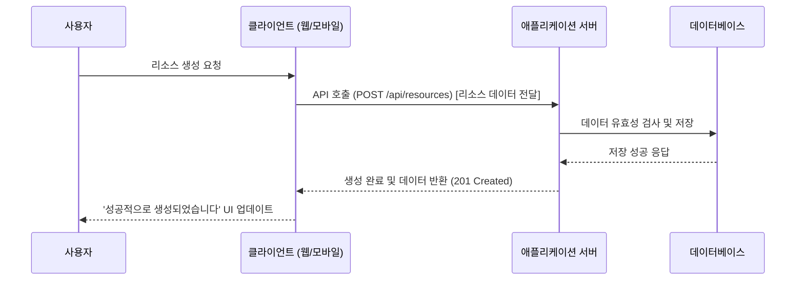

# [시나리오 이름] 데이터 흐름

* **시나리오 요약**: [이 데이터 흐름이 설명하는 사용자 시나리오를 한 문장으로 요약합니다.]
* **관련 기능 또는 목표**: [관련된 기능명 또는 작업 티켓 ID를 기입합니다.]

---

## 전제 조건 (Pre-conditions)

* [이 흐름이 시작되기 위해 만족해야 하는 조건을 기술합니다. 예: 사용자는 인증된 상태여야 합니다.]

## 흐름도 (Flow Diagram)

## 단계별 설명 (Step-by-step Explanation)

1. **사용자**: 클라이언트를 통해 특정 작업을 요청합니다.
2. **클라이언트**: 사용자의 요청을 받아 서버에 API를 호출합니다.
3. **애플리케이션 서버**: 비즈니스 로직을 수행하고 데이터베이스에 데이터를 저장합니다.
4. ...

## 주요 예외 흐름 (Alternative/Error Flows)

* **시나리오**: 서버에서 유효성 검사 실패
    1. **Client** -> **Server**: API 호출 (부정확한 데이터 포함)
    2. **Server** -->> **Client**: 유효성 검사 오류 응답 (400 Bad Request)
    3. **Client** -->> **User**: 입력 폼에 오류 메시지 표시

## 최종 상태 (Post-conditions)

* [흐름이 성공적으로 완료된 후 보장되는 시스템의 상태를 기술합니다. 예: `resources` 테이블에 새로운 데이터가 추가됩니다.]
